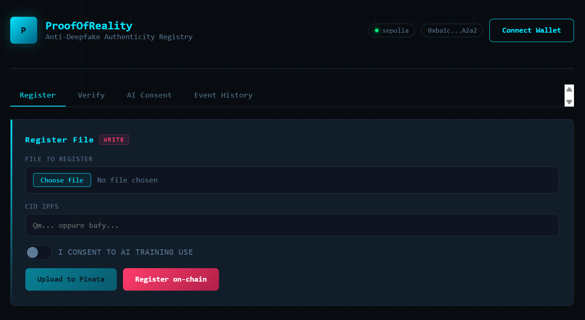

# ProofOfReality dApp

The **ProofOfReality** dApp was created to counter the spread of deepfakes and manipulated content: it allows you to **certify the authenticity of images and videos from the moment of their creation**, recording the file hash and an IPFS reference (CID) on the blockchain. This way, anyone can verify at any time whether content is original and who registered it.

Smart contract link: [0xf1cb9961f87fc8f4ffa7b28ff4d5f067e0c41b8f](https://sepolia.etherscan.io/address/0xf1cb9961f87fc8f4ffa7b28ff4d5f067e0c41b8f)

## Technology

- **Smart contract (on-chain backend)**: Solidity, developed and tested in Remix.
- **Frontend**: React + TypeScript + Vite with **ethers.js**.
- **Provider**: connection to an Ethereum node (e.g. Alchemy) via `JsonRpcProvider`.
- **Contract abstraction**: `Contract` instance created with **address** + **ABI**.
- **Signer**: EIP-1193 wallet (e.g. MetaMask) for write on-chain operations.
- **Decentralized storage**: Pinata (IPFS) for file storage and CID retrieval.

## Main Features

### Frontend

- Upload files (images/videos) to Pinata and obtain CID.
- Calculate **SHA-256** hash in the browser.
- **Register on-chain** the file (`registerFile`) with CID + hash + AI consent.
- **Verify on-chain** the file (`verifyFile`) via hash or uploaded file.
- **Manage AI consent** (`setAiConsent`) with on-chain fee, only by creator.
- **Event history**: query `FileRegistered` and `ConsentChanged` events starting from a defined block.

### Smart contract

- Unique on-chain registry of files with hash, CID, creator, timestamp, and AI consent.
- IPFS CID validation (v0 or v1).
- Protections against duplicates and null hashes.
- AI consent update with configurable fee and refund of excess.
- Events for auditing and tracking (registrations and consent changes).
- Owner functions: update fee, two-step ownership transfer, withdraw.

## Requirements

- Node.js 20+
- npm
- Browser wallet (MetaMask or EIP-1193 compatible)
- Smart contract deployed and ABI available

## Installation

```bash
npm install
```

## Environment Configuration

Copy `.env.example` to `.env` and fill in the values:
```bash
cp .env.example .env
```

Variables:
- `VITE_ALCHEMY_RPC_URL`: Alchemy RPC endpoint of the network where the contract is deployed
- `VITE_CONTRACT_ADDRESS`: `ProofOfReality` contract address
- `VITE_PINATA_JWT`: Pinata JWT for file upload
- `VITE_START_BLOCK`: initial block for event queries (optional)

## Local Start

```bash
npm run dev
```

## Operational Flow (high level)

1. The user selects a file and the frontend calculates the SHA-256 hash.
2. The file is uploaded to Pinata and the IPFS CID is obtained.
3. The wallet signs the `registerFile` transaction to register hash, CID, and AI consent.
4. To verify content, the hash is recalculated and `verifyFile` is called.
5. The creator can modify AI consent via `setAiConsent` by paying the fee.

## Notes on Provider and Signer

- **Read** operations use `JsonRpcProvider` (no wallet required).
- **Write** operations use `BrowserProvider` + `Signer` (MetaMask).
- The contract allows consent change only to the creator (`NotFileCreator` otherwise).

